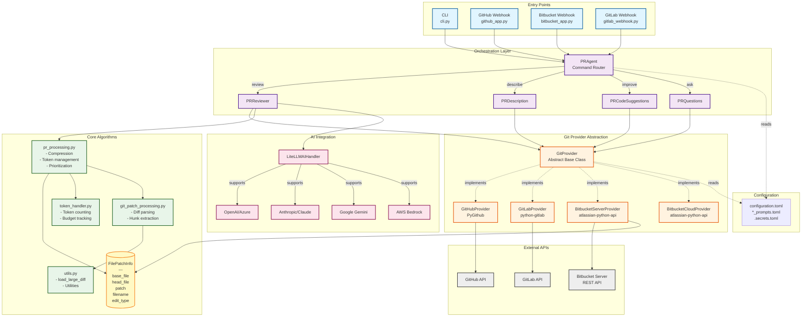

# PR-Agent Architecture Overview

## System Architecture

PR-Agent is a modular AI-powered code review system that supports multiple git providers (GitHub, GitLab, Bitbucket Server/Cloud, Azure DevOps, Gitea).

### Key Design Patterns

1. **Provider Pattern**: Abstract git provider interface with platform-specific implementations
2. **Command Pattern**: Commands (review, describe, improve) mapped to tool classes
3. **Strategy Pattern**: Different compression strategies based on PR size
4. **Factory Pattern**: Git provider factory based on configuration

## Component Architecture



## Component Responsibilities

### Entry Points

**CLI (`pr_agent/cli.py`)**
- Command-line interface for local PR analysis
- Usage: `pr-agent --pr_url=<url> review`
- Direct invocation of PRAgent

**Webhook Servers (`pr_agent/servers/`)**
- HTTP endpoints for git provider webhooks
- Event processing and authentication
- Async command execution

### Orchestration

**PRAgent (`pr_agent/agent/pr_agent.py`)**
- Central command router
- Maps commands to tool classes
- Applies repository-specific settings
- Manages tool lifecycle

### Git Provider Abstraction

**GitProvider (Abstract Base)**
- Defines common interface for all providers
- Key methods: `get_diff_files()`, `publish_comment()`, `get_pr_description()`

**Provider Implementations**
- Platform-specific API integrations
- Authentication handling
- Rate limit management (varies by provider)

### Core Algorithms

**PRProcessing (`pr_agent/algo/pr_processing.py`)**
- PR diff compression for token limits
- File prioritization by language and importance
- Dynamic context extension

**TokenHandler (`pr_agent/algo/token_handler.py`)**
- Token counting for LLM limits
- Budget tracking across multiple API calls

**GitPatchProcessing (`pr_agent/algo/git_patch_processing.py`)**
- Unified diff parsing
- Hunk extraction and line mapping

### Tools

Each tool implements a specific PR analysis feature:
- **PRReviewer**: Code review with findings
- **PRDescription**: Auto-generate PR descriptions
- **PRCodeSuggestions**: Suggest code improvements
- **PRQuestions**: Answer questions about PR changes

## Data Structures

### FilePatchInfo

Core data structure representing a changed file:

```python
@dataclass
class FilePatchInfo:
    base_file: str        # Full original file content
    head_file: str        # Full new file content
    patch: str            # Unified diff patch
    filename: str         # File path
    edit_type: EDIT_TYPE  # ADDED/DELETED/MODIFIED/RENAMED
    tokens: int           # Token count
    num_plus_lines: int   # Lines added
    num_minus_lines: int  # Lines removed
    language: str         # Programming language
```

## Configuration

**Hierarchy (highest priority first):**
1. CLI arguments: `--config.param=value`
2. Repository settings: `.pr_agent.toml` in repo root
3. Global settings: User's global configuration
4. Default settings: `pr_agent/settings/configuration.toml`

## File Organization

```
pr_agent/
├── agent/              # Command routing
│   └── pr_agent.py
├── tools/              # Analysis tools
│   ├── pr_reviewer.py
│   ├── pr_description.py
│   └── ...
├── git_providers/      # Provider implementations
│   ├── git_provider.py (base)
│   ├── github_provider.py
│   ├── bitbucket_server_provider.py
│   └── ...
├── algo/               # Core algorithms
│   ├── pr_processing.py
│   ├── token_handler.py
│   └── ...
├── servers/            # Webhook servers
│   ├── github_app.py
│   ├── bitbucket_app.py
│   └── ...
└── settings/           # Configuration
    ├── configuration.toml
    └── *_prompts.toml
```

## See Also

- [sequence-diagrams.md](sequence-diagrams.md) - Detailed execution flows
- [class-diagrams.md](class-diagrams.md) - Class relationships
- [data-flow.md](data-flow.md) - Data processing pipelines
