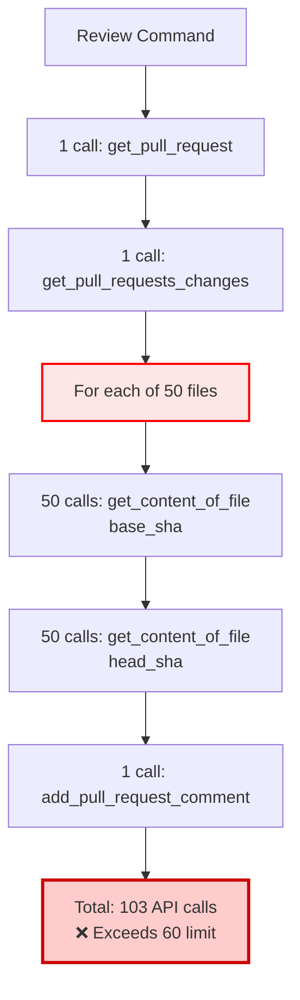

# Bitbucket Server Rate Limiting Issue

## Problem Summary

PR-Agent fails with `429 Client Error` when reviewing PRs with many files on Bitbucket Server due to exhausting the API rate limit (60 requests/burst) in a single `/review` command execution.

## Root Cause Analysis

### Token Bucket Algorithm

Bitbucket Server uses a **token bucket algorithm** for rate limiting:
- Default burst capacity: **60 requests**
- Refill rate: ~1 token per second (varies by configuration)
- No way to increase limit for service accounts

### API Call Pattern

For a PR with 50 modified files, PR-Agent makes:



| Step | API Endpoint | Calls | Purpose |
|------|-------------|-------|---------|
| 1 | `GET /pull-requests/{id}` | 1 | Fetch PR metadata |
| 2 | `GET /pull-requests/{id}/changes` | 1 | List changed files |
| 3 | `GET /browse/{path}?at={base_sha}` | 50 | Original file content |
| 4 | `GET /browse/{path}?at={head_sha}` | 50 | New file content |
| 5 | `POST /pull-requests/{id}/comments` | 1 | Post review |
| **Total** | | **103** | **❌ > 60 limit** |

## Code Location

### Bottleneck

**File**: `pr_agent/git_providers/bitbucket_server_provider.py`

**Method**: `get_diff_files()` (lines 229-307)

**Problem lines**:
```python
# Lines 277, 283, 289, 291
for change in changes:
    if edit_type == MODIFIED:
        original_file_content_str = self.get_file(file_path, base_sha)  # ← API call
        new_file_content_str = self.get_file(file_path, head_sha)       # ← API call
```

Each `get_file()` call triggers:
```python
# Line 204-207
def get_file(self, path: str, commit_id: str):
    file_content = self.bitbucket_client.get_content_of_file(
        self.workspace_slug, self.repo_slug, path, commit_id
    )  # ← REST API call
```

## Comparison: Why Other Providers Work

### GitHub Provider

```python
# github_provider.py uses PyGithub
files = pr.get_files()  # Single paginated call with patches included
for file in files:
    patch = file.patch  # Already in response
```

**Advantages**:
- Bulk file fetch with diffs included
- Built-in rate limit handling with retries
- Conditional requests with ETags

### Bitbucket Cloud Provider

```python
# bitbucket_provider.py lines 299-317
if get_settings().get("bitbucket_app.avoid_full_files", False):
    original_file_content_str = ""
    new_file_content_str = ""
elif counter_valid < MAX_FILES_ALLOWED_FULL // 2:  # Only 25 files
    # Fetch full content
else:
    # Skip full content, use patch only
```

**Advantages**:
- Limits full file fetches to 25 files
- Has fallback to patches-only mode
- Better designed for rate limits

## Solution Options

### Option 1: Implement avoid_full_files Config ✅ Recommended

Copy Bitbucket Cloud's approach:

```python
# In bitbucket_server_provider.py
if get_settings().get("bitbucket_server.avoid_full_files", False):
    original_file_content_str = ""
    new_file_content_str = ""
    # Use only patches from /diff endpoint
elif counter_valid < MAX_FILES_ALLOWED_FULL // 2:
    # Fetch full content for first 25 files
    original_file_content_str = self.get_file(file_path, base_sha)
    new_file_content_str = self.get_file(file_path, head_sha)
else:
    # Use patches only for remaining files
    original_file_content_str = ""
    new_file_content_str = ""
```

**Configuration**:
```toml
[bitbucket_server]
avoid_full_files = false  # Default: try to get full files
max_files_with_full_content = 25  # Limit to stay under rate limit
```

**Pros**:
- Reduces API calls from 102 to ~52 for 50-file PR
- Still provides full context for most important files
- Configurable behavior

**Cons**:
- May still hit rate limit on very large PRs
- Reduced context for files beyond the limit

---

### Option 2: Add Request Throttling

Add delays between API calls:

```python
import time

def get_file(self, path: str, commit_id: str):
    # Add configurable delay
    delay_ms = get_settings().get("bitbucket_server.api_call_delay_ms", 0)
    if delay_ms > 0:
        time.sleep(delay_ms / 1000.0)

    file_content = self.bitbucket_client.get_content_of_file(...)
    return file_content
```

**Configuration**:
```toml
[bitbucket_server]
api_call_delay_ms = 100  # 100ms between calls
```

**Pros**:
- Simple to implement
- Allows token bucket to refill during execution
- No quality reduction

**Cons**:
- Significantly slower (100ms × 100 calls = 10 seconds)
- May still fail for very large PRs
- Only delays the problem

---

### Option 3: Use /diff Endpoint (Not Viable)

Attempt to use Bitbucket's diff endpoint:

```python
# Hypothetical
diff = self.bitbucket_client.get(
    f"rest/api/1.0/projects/{project}/repos/{repo}/pull-requests/{pr_id}/diff"
)
```

**Problem**: Research shows `/diff` endpoint requires a file path:
```
/pull-requests/{id}/diff/{path}  # ← Must specify path
```

**Result**: No batch diff API exists in Bitbucket Server. Still requires per-file calls.

---

### Option 4: Patches-Only Mode

Skip all full file content:

```toml
[bitbucket_server]
avoid_full_files = true
```

**Pros**:
- Minimal API calls (~3 total)
- No rate limiting issues

**Cons**:
- Significant quality reduction
- AI only sees diff, not full file context
- May miss important context

---

### Option 5: Request Rate Limit Exemption (User Action)

Contact Bitbucket Server admin to:
- Increase rate limit for pr-agent service account
- Exempt service account from rate limiting

**Pros**:
- No code changes needed
- Maintains full quality

**Cons**:
- Requires admin access and approval
- May not be possible in some organizations
- Takes time to implement

---

## Recommended Approach

**Hybrid Strategy** (Option 1 + Option 2):

1. **Implement `max_files_with_full_content` limit** (Option 1)
   - Fetch full content for first 25 files (50 API calls)
   - Use patches-only for remaining files
   - Reduces total calls: 2 + 50 + 1 = **53 calls** (within 60 limit)

2. **Add optional throttling** (Option 2)
   - Configurable delay for users who still hit limits
   - Default: 0ms (no delay)
   - Can be increased if needed

3. **Make it configurable**:
   ```toml
   [bitbucket_server]
   avoid_full_files = false           # Default: get full files when possible
   max_files_with_full_content = 25   # Stay under 60 API limit
   api_call_delay_ms = 0               # Optional throttling
   ```

This approach:
- ✅ Stays within rate limits for typical PRs (up to 50 files)
- ✅ Maintains quality for most important files
- ✅ Provides fallback throttling if needed
- ✅ Fully configurable
- ✅ Mirrors proven pattern from Bitbucket Cloud provider

## Implementation Plan

1. Add configuration options to `configuration.toml`
2. Modify `bitbucket_server_provider.py::get_diff_files()` to:
   - Track file counter
   - Limit full content fetches to configured maximum
   - Add optional delays between API calls
3. Test with PRs of varying sizes
4. Update documentation with configuration guide

## See Also

- [FIX_BITBUCKET_RATE_LIMITING.md](../FIX_BITBUCKET_RATE_LIMITING.md) - Original retry-based proposal (not recommended)
- [data-flow.md](data-flow.md) - Detailed data flow diagrams
- [sequence-diagrams.md](sequence-diagrams.md) - Full request sequence
