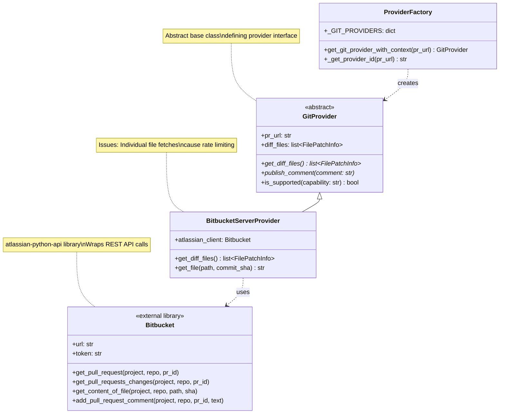
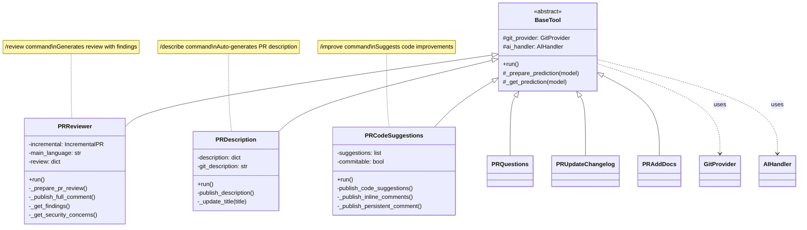
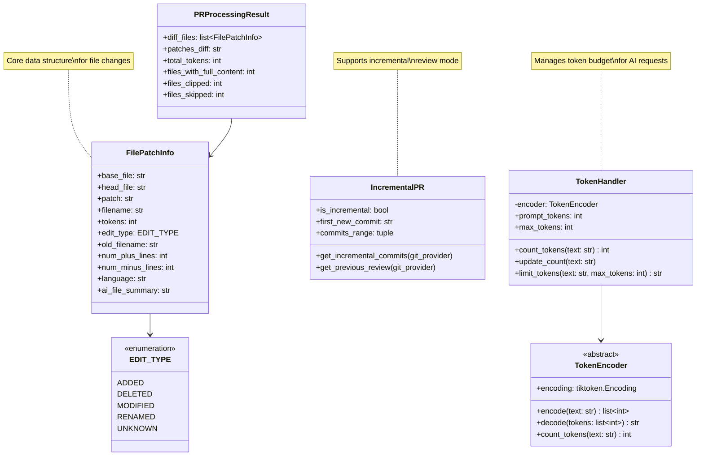
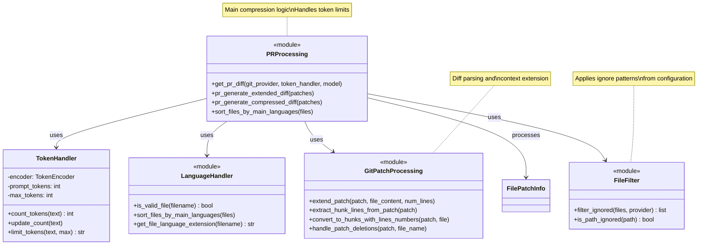
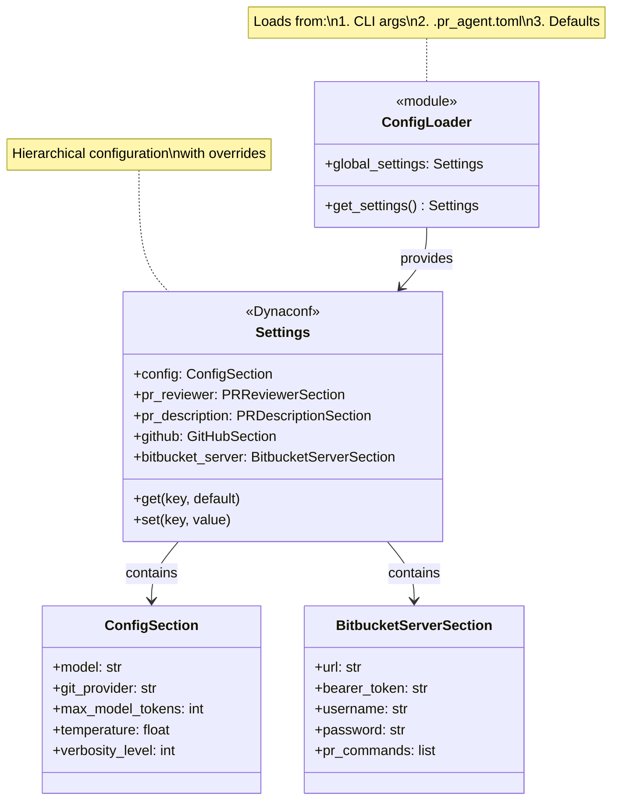

# Class Diagrams

This document shows the class structure and relationships in PR-Agent.

## Table of Contents

1. [Core Class Hierarchy](#core-class-hierarchy)
2. [Git Provider Pattern](#git-provider-pattern)
3. [Tool Classes](#tool-classes)
4. [Data Models](#data-models)

---

## Core Class Hierarchy

Complete class structure showing relationships between major components.

```mermaid
classDiagram
    class GitProvider {
        <<abstract>>
        +pr_url: str
        +diff_files: list
        +incremental: IncrementalPR
        +get_files() list~str~
        +get_diff_files() list~FilePatchInfo~
        +get_pr_description() str
        +get_pr_id() str
        +publish_comment(comment: str)
        +publish_code_suggestions(suggestions)
        +publish_labels(labels)
        +is_supported(capability) bool
        +get_languages()
        +get_pr_branch()
        +get_user_id() str
    }

    class BitbucketServerProvider {
        -bitbucket_client: Bitbucket
        -bitbucket_server_url: str
        -workspace_slug: str
        -repo_slug: str
        -pr_num: int
        -pr: dict
        -bearer_token: str
        -bitbucket_api_version: Version
        +get_diff_files() list~FilePatchInfo~
        +get_file(path: str, commit_id: str) str
        +get_files() list~str~
        +publish_comment(comment: str)
        +create_inline_comment(body, file, line)
        -_get_pr() dict
        -_parse_pr_url() tuple
        -_parse_bitbucket_server(url) str
        -get_best_common_ancestor() str
        -_get_merge_base() str
    }

    class GitHubProvider {
        -github_client: Github
        -repo: Repository
        -pr: PullRequest
        -github_user_id: str
        -installation_id: int
        +get_diff_files() list~FilePatchInfo~
        +get_files() list~str~
        +publish_comment(comment: str)
        +publish_code_suggestions(suggestions)
        +publish_inline_comment(body, file, line)
        +get_languages() dict
        -_parse_pr_url() tuple
        -_get_github_client() Github
    }

    class GitLabProvider {
        -gitlab_client: Gitlab
        -project: Project
        -mr: MergeRequest
        +get_diff_files() list~FilePatchInfo~
        +get_files() list~str~
        +publish_comment(comment: str)
        +create_inline_comment(body, file, line)
        -_parse_mr_url() tuple
    }

    class AzureDevopsProvider {
        -azure_client: Connection
        -git_client: GitClient
        -repo_id: str
        -pr_id: int
        +get_diff_files() list~FilePatchInfo~
        +publish_comment(comment: str)
        -_get_azure_client() Connection
    }

    GitProvider <|-- BitbucketServerProvider
    GitProvider <|-- GitHubProvider
    GitProvider <|-- GitLabProvider
    GitProvider <|-- AzureDevopsProvider
    GitProvider <|-- BitbucketProvider
    GitProvider <|-- GiteaProvider

    class FilePatchInfo {
        +base_file: str
        +head_file: str
        +patch: str
        +filename: str
        +tokens: int
        +edit_type: EDIT_TYPE
        +old_filename: str
        +num_plus_lines: int
        +num_minus_lines: int
        +language: str
        +ai_file_summary: str
    }

    class EDIT_TYPE {
        <<enumeration>>
        ADDED = 1
        DELETED = 2
        MODIFIED = 3
        RENAMED = 4
        UNKNOWN = 5
    }

    GitProvider --> FilePatchInfo : creates
    FilePatchInfo --> EDIT_TYPE : uses

    class PRAgent {
        -command2class: dict
        -git_provider: GitProvider
        +handle_request(pr_url, command, args)
        +apply_repo_settings(git_provider)
        -_handle_request(pr_url, tool, args)
        -_prepare_bot_identifier(provider)
    }

    class PRReviewer {
        -git_provider: GitProvider
        -ai_handler: AIHandler
        -incremental: IncrementalPR
        -main_language: str
        -review: dict
        +run()
        +push(data)
        -_prepare_prediction(model)
        -_get_prediction(model)
        -_prepare_pr_review()
        -_publish_full_comment(review)
    }

    class PRDescription {
        -git_provider: GitProvider
        -ai_handler: AIHandler
        -description: dict
        +run()
        -_prepare_prediction(model)
        -_get_prediction(model)
        -publish_description()
    }

    class PRCodeSuggestions {
        -git_provider: GitProvider
        -ai_handler: AIHandler
        -suggestions: list
        +run()
        -_prepare_prediction(model)
        -_get_prediction(model)
        -publish_code_suggestions()
        -_publish_inline_comments()
    }

    class PRQuestions {
        -git_provider: GitProvider
        -ai_handler: AIHandler
        -question: str
        -answer: str
        +run()
        -_prepare_prediction(model)
        -_get_prediction(model)
        -publish_answer()
    }

    PRAgent --> PRReviewer : creates
    PRAgent --> PRDescription : creates
    PRAgent --> PRCodeSuggestions : creates
    PRAgent --> PRQuestions : creates

    PRReviewer --> GitProvider : uses
    PRDescription --> GitProvider : uses
    PRCodeSuggestions --> GitProvider : uses
    PRQuestions --> GitProvider : uses

    class LiteLLMAIHandler {
        -deployment_id: str
        +chat_completion(model, messages, temperature)
        -_chat_completion(model, messages)
    }

    class OpenAIAIHandler {
        -openai_client: OpenAI
        +chat_completion(model, messages, temperature)
    }

    class AnthropicAIHandler {
        -anthropic_client: Anthropic
        +chat_completion(model, messages, temperature)
    }

    class AIHandler {
        <<interface>>
        +chat_completion(model, messages, temperature)
    }

    AIHandler <|.. LiteLLMAIHandler
    AIHandler <|.. OpenAIAIHandler
    AIHandler <|.. AnthropicAIHandler

    PRReviewer --> AIHandler : uses
    PRDescription --> AIHandler : uses
    PRCodeSuggestions --> AIHandler : uses
    PRQuestions --> AIHandler : uses
```

---

## Git Provider Pattern

Detailed view of the provider abstraction.

---

## Tool Classes

Structure of tool implementations.

---

## Data Models

Core data structures.

---

## Processing Pipeline Classes

Classes involved in diff processing and compression.

---

## Configuration System

---

## See Also

- [architecture-overview.md](architecture-overview.md) - System overview
- [sequence-diagrams.md](sequence-diagrams.md) - Execution flows
- [data-flow.md](data-flow.md) - Data processing details
