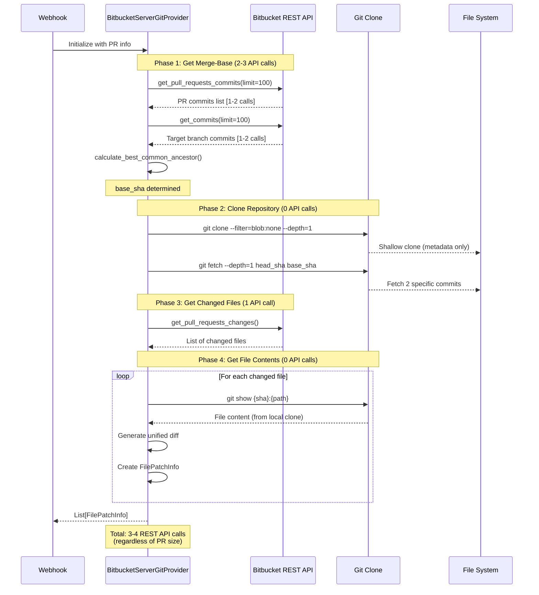
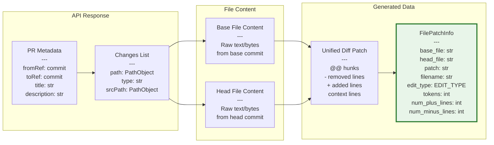
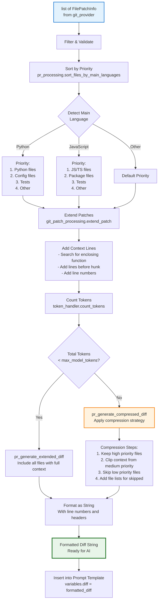
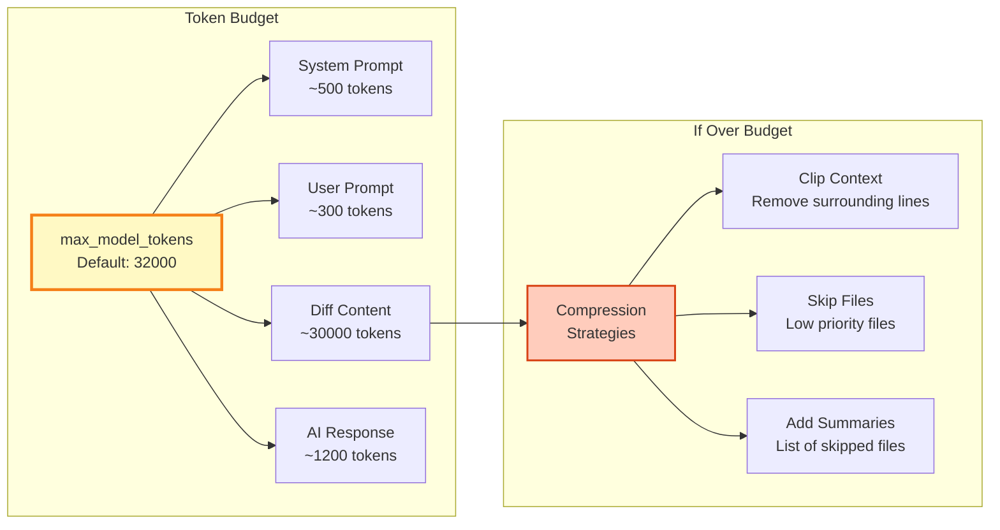
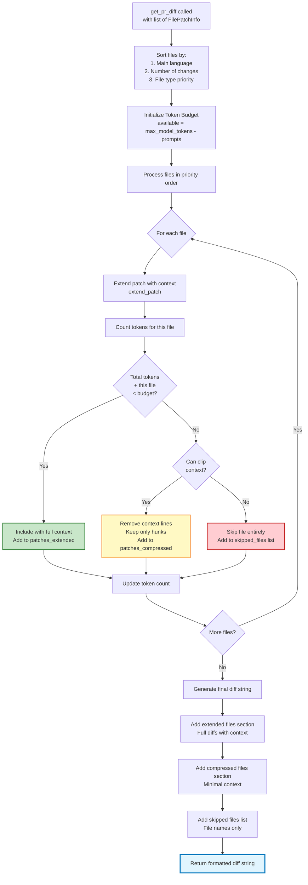
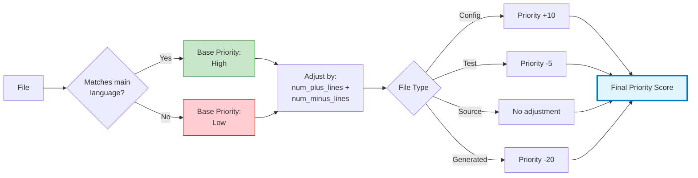
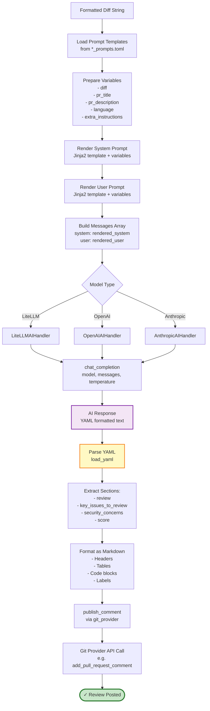
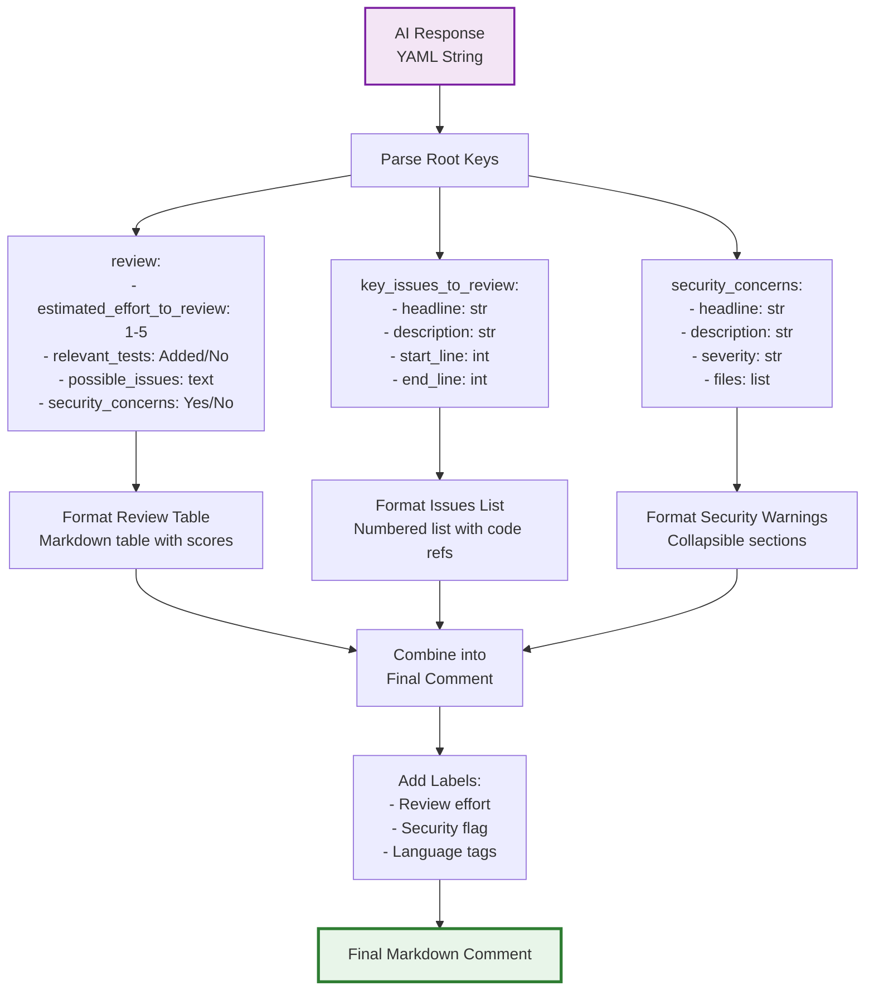
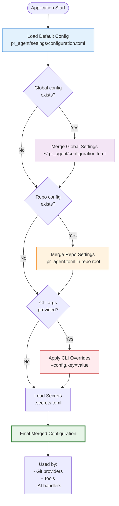

# Data Flow Diagrams

This document shows how data flows through PR-Agent during various operations.

## Table of Contents

1. [File Fetching Flow (Bitbucket Server)](#file-fetching-flow-bitbucket-server)
2. [PR Diff Processing Pipeline](#pr-diff-processing-pipeline)
3. [Compression Strategy](#compression-strategy)
4. [AI Request/Response Flow](#ai-requestresponse-flow)

---

## File Fetching Flow (Bitbucket Server)

Shows the hybrid REST API + Git clone approach for efficient file fetching with minimal API calls.

### Current Implementation: Hybrid Approach

### Performance Comparison

| Approach | API Calls (50 files) | Rate Limit Impact | Scalability | File Access Speed |
|----------|---------------------|-------------------|-------------|------------------|
| **Old: Pure REST API** | 103 | ❌ Exceeds 60 limit | ❌ Fails on large PRs | ~30s |
| **New: Hybrid Git Clone** | 3-4 | ✅ Well under limit | ✅ Works for any size | ~5-8s |

### Benefits

- **96% fewer API calls**: 3-4 vs 103 calls for 50-file PR
- **No rate limiting**: Always stays under Bitbucket's 60-token burst limit
- **Faster**: 5-8s vs 30s for large PRs
- **Scalable**: Works for PRs of any size (100+ files)
- **Handles long-lived branches**: Merge-base calculation works regardless of branch divergence
- **No quality loss**: Full file contents always available via git

### Data Structures at Each Stage

---

## PR Diff Processing Pipeline

Shows how FilePatchInfo objects are transformed into AI-ready prompts.

### Token Budget Allocation

---

## Compression Strategy

Detailed breakdown of the compression algorithm when PRs exceed token limits.

### File Priority Calculation

---

## AI Request/Response Flow

Shows the complete flow from diff to published review.

### AI Response Structure

---

## Configuration Loading Flow

Shows how configuration is loaded and merged from multiple sources.

---

## See Also

- [architecture-overview.md](architecture-overview.md) - System architecture
- [sequence-diagrams.md](sequence-diagrams.md) - Execution sequences
- [class-diagrams.md](class-diagrams.md) - Class structure
