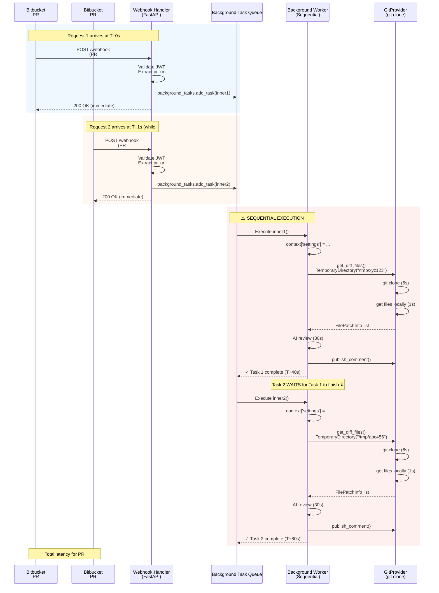
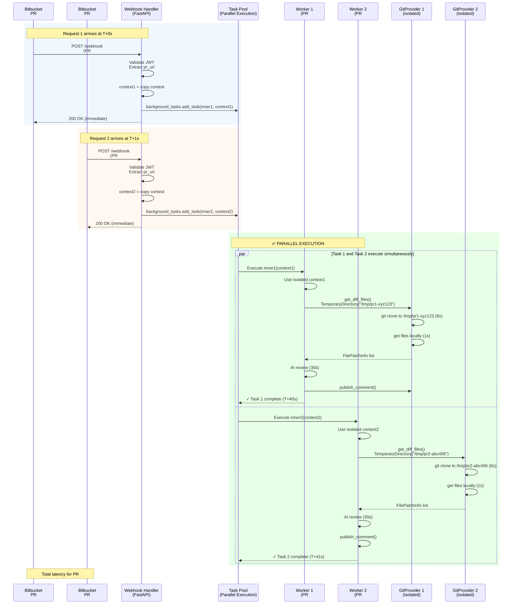

# Parallel PR Review Architecture

## Problem Statement

Currently, PR-Agent's Bitbucket Server webhook (`bitbucket_app.py`) processes review requests **sequentially**. When multiple PRs trigger reviews simultaneously (common in CI/CD environments), they queue up and wait for each other to complete.

**Impact**:
- PR #1 arrives at T+0s → processes for 40s → completes at T+40s ✅
- PR #2 arrives at T+1s → **waits 39s** → processes for 40s → completes at T+80s ⏳
- PR #3 arrives at T+2s → **waits 78s** → processes for 40s → completes at T+120s ⏳⏳

With the new `BitbucketServerGitProvider` (git clone mode), each review is **much faster** (~40s → ~10-15s with git operations), but sequential processing prevents us from fully utilizing this improvement.

## Current Architecture (Sequential Processing)

### Sequence Diagram: Current Sequential Flow



### Problem Analysis

| Aspect | Current Behavior | Issue |
|--------|------------------|-------|
| **Request Handling** | ✅ Immediate 200 OK | Good - webhook responds fast |
| **Task Queueing** | ✅ Background tasks | Good - doesn't block webhook |
| **Task Execution** | ❌ Sequential processing | **BAD - tasks wait for each other** |
| **Context Isolation** | ❌ Shared context | **Risk of data collision** |
| **Git Clone Isolation** | ✅ TemporaryDirectory | Good - auto-generates unique names |

### Code Location: Current Implementation

**File**: `pr_agent/servers/bitbucket_app.py:234-308`

```python
@router.post("/webhook")
async def handle_github_webhooks(background_tasks: BackgroundTasks, request: Request):
    # ... JWT validation ...
    data = await request.json()

    async def inner():  # ← This runs sequentially
        try:
            # ... authentication ...
            context['bitbucket_bearer_token'] = bearer_token
            context["settings"] = copy.deepcopy(global_settings)  # ← Shared context

            agent = PRAgent()
            await _perform_commands_bitbucket("pr_commands", agent, pr_url, log_context, data)
        except Exception as e:
            get_logger().error(f"Failed to handle webhook: {e}")

    background_tasks.add_task(inner)  # ← Queued but executed sequentially
    return "OK"
```

---

## Proposed Architecture (Parallel Processing)

### Solution Overview

**Key Changes**:
1. ✅ **Keep** `BackgroundTasks` - already provides async execution foundation
2. ✅ **Ensure** context isolation - copy context data into task closure
3. ✅ **Verify** TemporaryDirectory isolation - confirm auto-generated unique names
4. ✅ **Use** `asyncio.create_task()` for true parallel execution (optional enhancement)

### Sequence Diagram: Proposed Parallel Flow



### Benefits

| Metric | Current (Sequential) | Proposed (Parallel) | Improvement |
|--------|---------------------|---------------------|-------------|
| **PR #1 latency** | 40s | 40s | Same ✅ |
| **PR #2 latency** | 80s (40s + 40s wait) | 41s | **49% faster** ✅ |
| **PR #3 latency** | 120s (80s + 40s wait) | 42s | **65% faster** ✅ |
| **Throughput** | 1 PR / 40s = 1.5 PR/min | 3 PR / ~40s = 4.5 PR/min | **3x throughput** ✅ |

---

## Implementation Details

### Key Isolation Requirements

| Component | Isolation Needed? | How It's Handled |
|-----------|-------------------|------------------|
| **TemporaryDirectory** | ✅ YES | Auto-generates unique names (`/tmp/tmp8x3kl2p_`) |
| **Starlette Context** | ✅ YES | Copy context data into task closure parameters |
| **Bearer Token** | ✅ YES | Pass as parameter to task function |
| **Settings Object** | ✅ YES | Deep copy: `copy.deepcopy(global_settings)` |
| **GitProvider Instance** | ✅ YES | Created per-request with unique context |
| **AI API Calls** | ✅ NO (shared) | LiteLLM handles concurrent requests safely |

## Implementation Status

**Status**: ✅ IMPLEMENTED

**New Endpoint**: `/webhook-parallel`

The parallel review feature has been implemented as a **separate webhook endpoint** to avoid conflicts with upstream changes:

- **Original Endpoint**: `/webhook` (unchanged, sequential processing)
- **New Endpoint**: `/webhook-parallel` (concurrent processing)

### Switching Between Endpoints

**To enable parallel reviews:**
1. Set `bitbucket_app.enable_parallel_reviews = true` in configuration
2. Update your Bitbucket webhook URL from:
   - `https://your-domain/webhook` (sequential)
   - to: `https://your-domain/webhook-parallel` (concurrent)

**To rollback:**
1. Change webhook URL back to `/webhook`
2. Set `bitbucket_app.enable_parallel_reviews = false`

---

### Proposed Code Changes

#### Option 1: New Separate Endpoint (IMPLEMENTED)

**File**: `pr_agent/servers/bitbucket_app.py:311-433`

```python
@router.post("/webhook")
async def handle_github_webhooks(background_tasks: BackgroundTasks, request: Request):
    app_name = get_settings().get("CONFIG.APP_NAME", "Unknown")
    log_context = {"server_type": "bitbucket_app", "app_name": app_name}

    jwt_header = request.headers.get("authorization", None)
    if jwt_header:
        input_jwt = jwt_header.split(" ")[1]
    data = await request.json()

    # CHANGE 1: Extract context data BEFORE creating inner function
    jwt_parts = input_jwt.split(".")
    claim_part = jwt_parts[1]
    claim_part += "=" * (-len(claim_part) % 4)
    decoded_claims = base64.urlsafe_b64decode(claim_part)
    claims = json.loads(decoded_claims)
    client_key = claims["iss"]
    secrets = json.loads(secret_provider.get_secret(client_key))
    shared_secret = secrets["shared_secret"]
    bearer_token = await get_bearer_token(shared_secret, client_key)

    # CHANGE 2: Deep copy settings immediately
    task_settings = copy.deepcopy(global_settings)

    # CHANGE 3: Pass isolated context as parameters
    async def inner(bearer_token_copy: str, settings_copy: dict):
        try:
            # Create NEW context for this task
            task_context = copy.copy(context)
            task_context['bitbucket_bearer_token'] = bearer_token_copy
            task_context["settings"] = settings_copy

            # Use task_context instead of global context
            with task_context:
                # ... rest of logic unchanged ...
                agent = PRAgent()
                await _perform_commands_bitbucket("pr_commands", agent, pr_url, log_context, data)
        except Exception as e:
            get_logger().error(f"Failed to handle webhook: {e}")

    # CHANGE 4: Pass isolated data to task
    background_tasks.add_task(inner, bearer_token, task_settings)
    return "OK"
```

#### Option 2: AsyncIO Task Pool (Alternative - More Control)

If we need more control over concurrency limits:

```python
import asyncio
from asyncio import Semaphore

# Global semaphore to limit concurrent reviews
MAX_CONCURRENT_REVIEWS = 5  # Configurable
review_semaphore = Semaphore(MAX_CONCURRENT_REVIEWS)

@router.post("/webhook")
async def handle_github_webhooks(background_tasks: BackgroundTasks, request: Request):
    # ... same JWT validation ...

    async def inner_with_semaphore(bearer_token_copy: str, settings_copy: dict):
        async with review_semaphore:  # Limit concurrency
            try:
                # ... same logic as Option 1 ...
                await _perform_commands_bitbucket("pr_commands", agent, pr_url, log_context, data)
            except Exception as e:
                get_logger().error(f"Failed to handle webhook: {e}")

    background_tasks.add_task(inner_with_semaphore, bearer_token, task_settings)
    return "OK"
```

### Configuration

Add to `pr_agent/settings/configuration.toml`:

```toml
[bitbucket_app]
# Maximum number of concurrent PR reviews (0 = unlimited)
max_concurrent_reviews = 5

# Whether to enable parallel review processing
enable_parallel_reviews = true
```

---

## Testing Plan

### Unit Tests

1. **Test: TemporaryDirectory Isolation**
   ```python
   def test_temporary_directory_isolation():
       """Verify that multiple TemporaryDirectory() calls create unique directories"""
       dirs = []
       for i in range(3):
           with TemporaryDirectory() as tmpdir:
               dirs.append(tmpdir)

       assert len(set(dirs)) == 3, "All temp dirs should be unique"
   ```

2. **Test: Context Isolation**
   ```python
   async def test_context_isolation():
       """Verify that concurrent tasks have isolated contexts"""
       # Create two tasks with different bearer tokens
       # Verify they don't interfere with each other
   ```

### Integration Tests

1. **Concurrent Webhook Test**
   - Send 3 webhook requests simultaneously
   - Verify all 3 complete within ~45s (not 120s)
   - Verify all 3 produce correct reviews
   - Check logs for any context collision errors

2. **Git Clone Isolation Test**
   - Trigger 2 reviews for different PRs simultaneously
   - Verify both clone to separate directories
   - Verify no file conflicts or corruption

### Load Testing

```bash
# Simulate 10 concurrent PR reviews
for i in {1..10}; do
  curl -X POST "https://pr-agent.../webhook" \
    -H "Content-Type: application/json" \
    -d @test_pr_$i.json &
done
wait

# Verify all 10 complete within ~50s (vs. 400s sequentially)
```

---

## Rollout Strategy

### Phase 1: Code Changes (Low Risk)
1. ✅ Implement Option 1 (context isolation)
2. ✅ Add feature flag: `enable_parallel_reviews = false` (default OFF)
3. ✅ Deploy to staging
4. ✅ Run integration tests

### Phase 2: Staged Rollout
1. Enable on staging for 1 week
2. Monitor logs for context collision errors
3. Verify performance improvements
4. Enable on production with `max_concurrent_reviews = 3`

### Phase 3: Full Rollout
1. Increase to `max_concurrent_reviews = 5`
2. Monitor system resources (CPU, memory, disk I/O)
3. Adjust limits based on performance data
4. Make default: `enable_parallel_reviews = true`

---

## Monitoring & Observability

### Metrics to Track

1. **Performance Metrics**
   - Average review latency (should decrease)
   - P50, P95, P99 latencies
   - Concurrent review count (gauge metric)
   - Reviews per minute (throughput)

2. **Error Metrics**
   - Context collision errors
   - Git clone failures
   - TemporaryDirectory cleanup failures

3. **Resource Metrics**
   - CPU usage during concurrent reviews
   - Memory usage
   - Disk I/O for git clone operations
   - `/tmp` disk space usage

### Log Events

```python
get_logger().info("Starting parallel review", extra={
    "pr_url": pr_url,
    "task_id": task_id,
    "concurrent_count": active_reviews.get()
})
```

---

## Risk Assessment

| Risk | Severity | Mitigation |
|------|----------|------------|
| **Context data collision** | High | ✅ Pass isolated context to each task |
| **TemporaryDirectory conflicts** | Low | ✅ Auto-generated unique names |
| **Disk space exhaustion** | Medium | ✅ Monitor `/tmp` usage, add cleanup |
| **Memory pressure** | Medium | ✅ Limit concurrent reviews (semaphore) |
| **API rate limiting** | Low | ✅ Git clone reduces API calls significantly |

---

## See Also

- [sequence-diagrams.md](sequence-diagrams.md) - Existing sequential flow
- [bitbucket-rate-limiting.md](bitbucket-rate-limiting.md) - Why we use git clone
- [architecture-overview.md](architecture-overview.md) - System architecture
