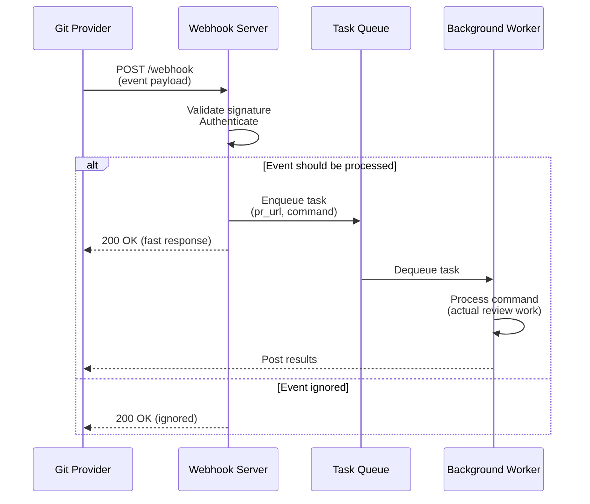

# Sequence Diagrams

This document contains detailed sequence diagrams for different PR-Agent operations.

## Table of Contents

1. [/review Command (Bitbucket Server)](#review-command-bitbucket-server)
2. [/review Command (GitHub)](#review-command-github)
3. [CLI Execution Flow](#cli-execution-flow)

---

## /review Command (Bitbucket Server)

This diagram shows the complete flow from webhook trigger to published review for Bitbucket Server.

**Key Issue**: Note the file fetching loop that causes rate limiting problems.

```mermaid
sequenceDiagram
    participant BB as Bitbucket Server
    participant WH as bitbucket_app<br/>(webhook)
    participant Agent as PRAgent
    participant Tool as PRReviewer
    participant Provider as BitbucketServerProvider
    participant Proc as pr_processing
    participant AI as AI Model
    participant API as Bitbucket API

    rect rgb(255, 240, 240)
        Note over BB,WH: 1. Webhook & Authentication
        BB->>WH: POST /webhook<br/>(PR created event)
        WH->>WH: JWT validation<br/>Generate Bearer Token
    end

    rect rgb(240, 248, 255)
        Note over WH,Agent: 2. Command Routing
        WH->>Agent: handle_request(pr_url, "review")
        Agent->>Tool: Initialize PRReviewer
        Tool->>Provider: Initialize BitbucketServerProvider
    end

    rect rgb(255, 250, 240)
        Note over Provider,API: 3. File Fetching (RATE LIMIT BOTTLENECK)
        Provider->>API: get_pull_request(project, repo, pr_id)
        API-->>Provider: PR metadata (fromRef, toRef)

        Provider->>API: get_pull_requests_changes()
        API-->>Provider: [{path: "file1.py", type: "MODIFY"}, ...]

        Note over Provider,API: ⚠️ For 50 files = 100 API calls
        loop For each changed file
            Provider->>API: get_content_of_file(path, base_sha)
            API-->>Provider: Original file content
            Provider->>API: get_content_of_file(path, head_sha)
            API-->>Provider: New file content
        end

        Provider->>Provider: load_large_diff()<br/>(generate unified diff)
        Provider->>Provider: Build FilePatchInfo objects
        Provider-->>Tool: list[FilePatchInfo]
    end

    rect rgb(240, 255, 240)
        Note over Tool,Proc: 4. PR Processing & Compression
        Tool->>Proc: get_pr_diff(diff_files, token_handler)
        Proc->>Proc: Sort by language priority<br/>Extend patches with context<br/>Compress if over token limit
        Proc-->>Tool: formatted_diff (string)
    end

    rect rgb(248, 240, 255)
        Note over Tool,AI: 5. AI Analysis
        Tool->>Tool: Prepare prompts<br/>(system + user + diff)
        Tool->>AI: chat_completion(messages)
        AI->>AI: Analyze code<br/>Generate review
        AI-->>Tool: YAML response<br/>(review, findings, security)
    end

    rect rgb(255, 248, 240)
        Note over Tool,API: 6. Publish Results
        Tool->>Tool: Parse & format response
        Tool->>Provider: publish_comment(markdown_review)
        Provider->>API: add_pull_request_comment()
        API-->>BB: ✓ Comment posted
    end

    Note over BB: Review comment<br/>appears on PR

    rect rgb(255, 230, 230)
        Note over Provider,API: 🔴 RATE LIMIT ISSUE<br/>Total API calls: ~102<br/>Burst limit: 60<br/>Result: 429 Error
    end
```



### API Call Breakdown (50-file PR)

| Step | API Call | Count | Purpose |
|------|----------|-------|---------|
| 3.1 | `get_pull_request()` | 1 | Fetch PR metadata |
| 3.2 | `get_pull_requests_changes()` | 1 | Get list of changed files |
| 3.3 | `get_content_of_file(base_sha)` | 50 | Fetch original content |
| 3.4 | `get_content_of_file(head_sha)` | 50 | Fetch new content |
| 6.1 | `add_pull_request_comment()` | 1 | Post review |
| **TOTAL** | | **103** | **Exceeds 60 limit** ❌ |

---

## /review Command (GitHub)

For comparison, GitHub provider has better rate limit handling and bulk diff APIs.

```mermaid
sequenceDiagram
    participant GH as GitHub
    participant WH as github_app<br/>(webhook)
    participant Agent as PRAgent
    participant Tool as PRReviewer
    participant Provider as GitHubProvider
    participant Proc as pr_processing
    participant AI as AI Model
    participant API as GitHub API

    rect rgb(240, 248, 255)
        Note over GH,WH: 1. Webhook & Authentication
        GH->>WH: POST /api/v1/github_webhooks<br/>(pull_request event)
        WH->>WH: Verify signature<br/>App JWT token
    end

    rect rgb(255, 240, 240)
        Note over WH,Agent: 2. Command Routing
        WH->>Agent: handle_request(pr_url, "review")
        Agent->>Tool: Initialize PRReviewer
        Tool->>Provider: Initialize GitHubProvider (PyGithub)
    end

    rect rgb(240, 255, 240)
        Note over Provider,API: 3. File Fetching (More Efficient)
        Provider->>API: get_pull(pr_number)
        API-->>Provider: PR object with metadata

        Note over Provider,API: ✓ Bulk diff fetch or paginated files
        Provider->>API: compare(base...head) OR get_files()
        API-->>Provider: File diffs with patches included

        Provider->>Provider: Parse response to FilePatchInfo
        Provider-->>Tool: list[FilePatchInfo]
    end

    rect rgb(248, 240, 255)
        Note over Tool,Proc: 4. PR Processing
        Tool->>Proc: get_pr_diff(diff_files)
        Proc-->>Tool: formatted_diff
    end

    rect rgb(255, 248, 240)
        Note over Tool,AI: 5. AI Analysis
        Tool->>AI: chat_completion(messages)
        AI-->>Tool: YAML response
    end

    rect rgb(240, 255, 240)
        Note over Tool,API: 6. Publish Results
        Tool->>Provider: publish_comment()
        Provider->>API: create_issue_comment()
        API-->>GH: ✓ Comment posted
    end

    rect rgb(230, 255, 230)
        Note over Provider,API: ✓ API calls: ~10-20<br/>Much more efficient<br/>Built-in rate limit handling
    end
```



### Key Differences from Bitbucket Server

| Aspect | Bitbucket Server | GitHub |
|--------|------------------|--------|
| **File Content Fetching** | Individual API call per file | Bulk diff or paginated |
| **API Calls (50 files)** | ~102 calls | ~10-20 calls |
| **Rate Limit Handling** | No built-in retry | PyGithub handles retries |
| **Diff Format** | Generated client-side | Provided by API |

---

## CLI Execution Flow

Direct CLI invocation without webhooks.

```mermaid
sequenceDiagram
    participant User
    participant CLI as cli.py
    participant Agent as PRAgent
    participant Tool as PRReviewer
    participant Provider as GitProvider
    participant AI as AI Model

    User->>CLI: pr-agent --pr_url=<url> review

    CLI->>CLI: Parse arguments<br/>Load configuration

    CLI->>Agent: run()<br/>pr_url, command="review"

    Agent->>Agent: Load repo settings<br/>from .pr_agent.toml

    Agent->>Tool: PRReviewer(pr_url)

    Tool->>Provider: Initialize provider<br/>based on URL

    Note over Tool,Provider: Provider determined by:<br/>- URL pattern<br/>- config.git_provider

    Tool->>Provider: get_diff_files()
    Provider-->>Tool: list[FilePatchInfo]

    Tool->>AI: chat_completion()
    AI-->>Tool: Review response

    Tool->>Provider: publish_comment()
    Provider-->>Tool: Success

    Tool-->>CLI: Review complete
    CLI-->>User: ✓ Done (or error)
```



### CLI Arguments

```bash
# Basic usage
pr-agent --pr_url=https://github.com/org/repo/pull/123 review

# With configuration overrides
pr-agent --pr_url=<url> review \
  --pr_reviewer.extra_instructions="focus on security" \
  --config.model="gpt-4"

# Different commands
pr-agent --pr_url=<url> describe
pr-agent --pr_url=<url> improve
pr-agent --pr_url=<url> ask "what does this change do?"
```

---

## Webhook Event Processing

High-level view of webhook event handling.



---

## See Also

- [architecture-overview.md](architecture-overview.md) - System architecture
- [data-flow.md](data-flow.md) - Data processing details
- [bitbucket-rate-limiting.md](bitbucket-rate-limiting.md) - Rate limiting issue analysis
